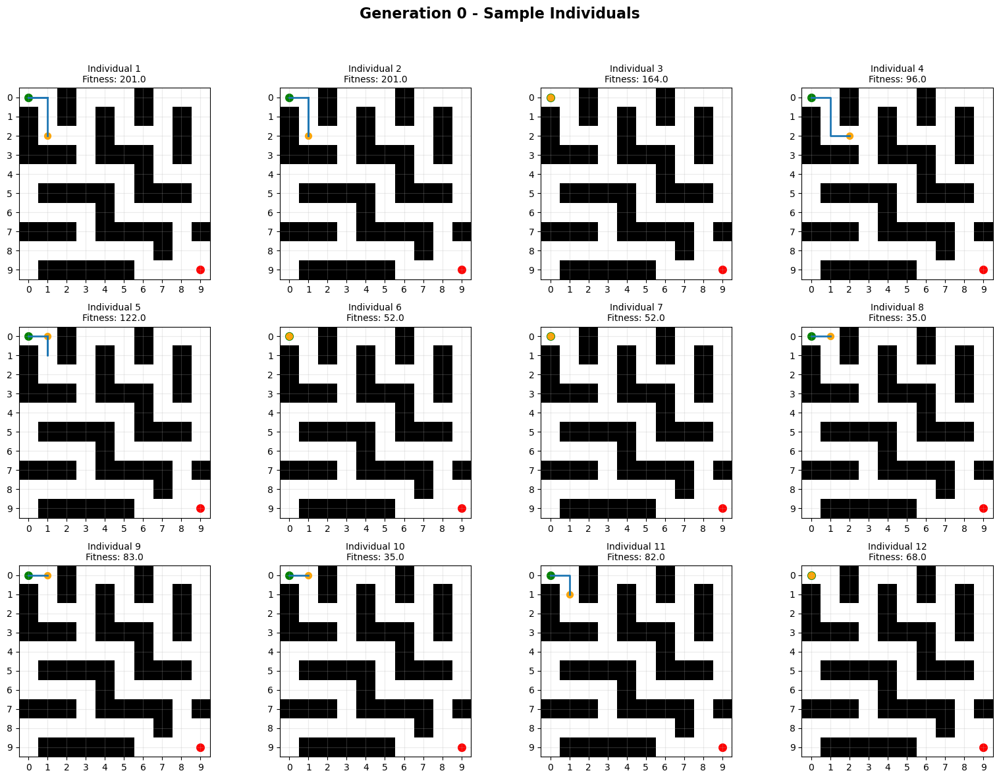
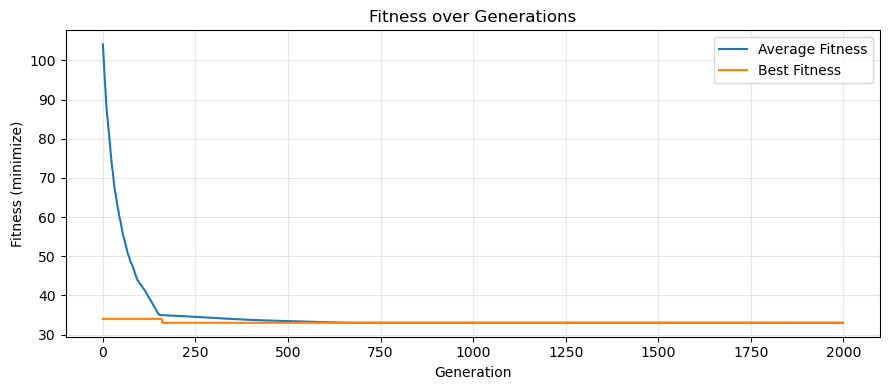
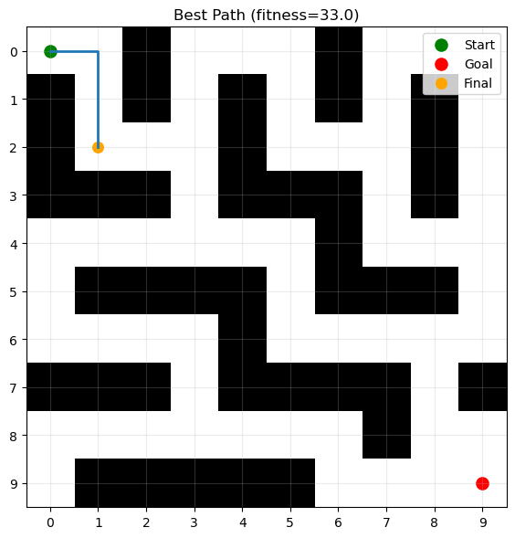

# Genetic Programming Maze Solver

## Overview

This project implements a Genetic Programming (GP) approach for evolving a maze-navigation agent. The agent starts at the top-left cell of a 10x10 maze and attempts to reach the bottom-right goal cell while avoiding walls, repeated positions, and unnecessarily long paths.

The project is an evolutionary computation / artificial intelligence notebook project. It uses tree-based GP individuals, a custom fitness function, roulette-wheel parent selection, subtree crossover, subtree mutation, and matplotlib visualizations to analyze evolutionary progress.

The current repository contains the implementation notebook, assignment documentation, a project report, exported figures from the saved notebook outputs, and reproducible setup instructions.

## Key Features

- Tree-based Genetic Programming representation using nested Python lists and terminal action strings.
- Maze-navigation environment with four movement primitives: `UP`, `DOWN`, `LEFT`, and `RIGHT`.
- Sequential function primitive `PROGN2` for composing executable movement programs.
- Ramped half-and-half population initialization using both `full` and `grow` tree generation.
- Fitness-proportionate parent selection adapted for a minimization objective.
- Subtree crossover and subtree mutation with maximum-depth control.
- Steady-state evolutionary replacement strategy.
- Visualizations for initial population behavior, fitness history, and the best discovered path.

## Project Highlights

- Built a complete GP workflow for a grid-based maze-navigation problem.
- Implemented custom tree creation, execution, fitness evaluation, selection, crossover, and mutation logic from scratch.
- Used a reproducible random seed in the main experiment runner.
- Documented and visualized evolutionary progress using notebook markdown and matplotlib plots.
- Organized saved notebook visual outputs into a `figures/` directory for GitHub-friendly presentation.

## Dataset

This project does not use a traditional external dataset. The input data is a hardcoded maze grid defined directly in `main3.ipynb` and also shown in `GP.pdf`.

| Item | Description |
| --- | --- |
| Dataset name | Hardcoded GP maze grid |
| Dataset source | Local assignment specification in `GP.pdf`; original external source is not specified in the current project files. |
| Dataset type | 2D grid / maze environment |
| Input format | Python list of lists containing integer cell values |
| Grid size | 10 rows x 10 columns |
| Free cell | `0` |
| Wall cell | `1` |
| Start position | `(0, 0)` |
| Goal position | `(9, 9)` |
| Labels/targets | Not applicable; this is not a supervised learning dataset. |
| Train/test split | Not used. |

The maze is:

```python
MAZE = [
    [0, 0, 1, 0, 0, 0, 1, 0, 0, 0],
    [1, 0, 1, 0, 1, 0, 1, 0, 1, 0],
    [1, 0, 0, 0, 1, 0, 0, 0, 1, 0],
    [1, 1, 1, 0, 1, 1, 1, 0, 1, 0],
    [0, 0, 0, 0, 0, 0, 1, 0, 0, 0],
    [0, 1, 1, 1, 1, 0, 1, 1, 1, 0],
    [0, 0, 0, 0, 1, 0, 0, 0, 0, 0],
    [1, 1, 1, 0, 1, 1, 1, 1, 0, 1],
    [0, 0, 0, 0, 0, 0, 0, 1, 0, 0],
    [0, 1, 1, 1, 1, 1, 0, 0, 0, 0],
]
```

### Preprocessing and Data Handling

- No missing-value handling is required because the maze is manually defined.
- No normalization, scaling, encoding, augmentation, or transformation is used.
- Out-of-bounds movement is treated as a wall collision by the environment logic.
- The agent path is generated dynamically while executing each GP tree.

## Project Structure

```text
HW4-EV-Mortazavian-40435074/
├── figures/
│   ├── best_path.png
│   ├── fitness_over_generations.png
│   └── generation_0_sample.png
├── GP.pdf
├── HW4_EC_DOC.pdf
├── main3.ipynb
├── README.md
├── requirements.txt
└── .gitignore
```

| Path | Purpose |
| --- | --- |
| `main3.ipynb` | Main Jupyter notebook containing the GP maze solver implementation, markdown explanations, experiment runner, and saved outputs. |
| `GP.pdf` | Assignment specification describing the GP maze-solving task, requirements, maze grid, suggested parameters, and evaluation criteria. |
| `HW4_EC_DOC.pdf` | Project report describing the implemented GP representation, fitness function, operators, workflow, and conclusions. |
| `figures/` | Exported PNG images from the saved notebook outputs for GitHub rendering. |
| `requirements.txt` | Minimal Python dependencies needed to open/run the notebook and generate plots. |
| `.gitignore` | Ignores local Python, notebook, environment, and system cache files. |

## Methodology / Workflow

### 1. Problem Setup

The notebook defines a fixed 10x10 maze, a start coordinate `(0, 0)`, and a goal coordinate `(9, 9)`. The agent can attempt one movement at a time in one of four directions.

### 2. GP Representation

Each individual is represented as either:

- a terminal action string such as `UP`, `DOWN`, `LEFT`, or `RIGHT`, or
- a nested list representing a function node such as `["PROGN2", child1, child2]`.

`PROGN2` executes its first child subtree and then its second child subtree, allowing larger programs to be composed from simple movement instructions.

### 3. Initialization

The initial population is created with ramped half-and-half initialization:

- `full`: function nodes are forced until the target depth is reached.
- `grow`: trees can stop early with terminals, creating more varied shapes.

The notebook uses:

| Hyperparameter | Value |
| --- | ---: |
| Population size | `200` |
| Maximum generations | `2000` |
| Maximum steps per episode | `60` |
| Initial maximum tree depth | `4` |
| Absolute maximum tree depth | `8` |
| Crossover rate | `0.9` |
| Mutation rate | `0.2` |

### 4. Execution

Each GP tree is executed recursively. Terminal nodes attempt movement in the maze. If the movement would hit a wall or leave the grid, the agent stays in place and the wall-hit counter increases.

Execution stops when:

- the agent reaches the goal, or
- the maximum step budget is reached.

### 5. Fitness Function

The fitness objective is minimized. The implementation follows the formula described in the assignment:

```text
F = s + 2d + 10w + 5l
```

where:

- `s` is the number of executed steps,
- `d` is the Manhattan distance from the final position to the goal,
- `w` is the number of wall hits,
- `l` is the number of revisited cells.

If an individual reaches the goal with zero wall hits, the notebook assigns a perfect fitness of `0.0`.

### 6. Selection and Variation

The notebook uses fitness-proportionate selection adapted for minimization. Lower-fitness individuals receive higher selection probability by inverting scores against the maximum fitness in the current population.

Variation operators:

- `crossover(parent1, parent2)`: inserts a random subtree from one parent into another parent.
- `mutate(individual)`: replaces a random subtree with a newly generated random branch.

Both operators enforce the configured maximum tree depth.

### 7. Evolutionary Strategy

The notebook uses a steady-state strategy. In each generation:

1. Two parents are selected.
2. Two children are produced through crossover and mutation.
3. Children are evaluated.
4. The worst individuals are replaced only if the children are better.

The run terminates when a perfect solution is found or the maximum generation count is reached.

## Visual Results

### Initial Population Sample



This figure shows sampled individuals from the first generation. Each subplot overlays an executed path on the maze and marks the start, goal, and final position.

### Fitness Over Generations



This plot shows average fitness and best fitness across the saved notebook run. Lower values are better because the GP problem is formulated as minimization.

### Best Path From Saved Run



This figure shows the best path recorded in the saved notebook output. In the current saved run, the agent did not reach the goal.

## Installation

This project is written in Python and intended to be run through Jupyter Notebook.

```bash
python -m venv venv
source venv/bin/activate
pip install -r requirements.txt
```

The notebook metadata records Python `3.11.5`.

## Usage

Start Jupyter Notebook:

```bash
jupyter notebook
```

Then open and run:

```text
main3.ipynb
```

The notebook defines a `main()` function and runs it through:

```python
if __name__ == "__main__":
    main()
```

Running all cells executes the GP experiment, prints generation progress, prints the best recorded individual, and renders the visualizations.

## Training / Running the Project

The primary experiment entry point is the notebook function:

```python
main()
```

The default run calls:

```python
best_ind, best_f, best_path, avg_hist, best_hist = evolve(
    seed=7,
    visualize_gen0=True
)
```

To adjust the experiment, edit the configuration constants near the top of `main3.ipynb`, including `POP_SIZE`, `MAX_GENERATIONS`, `MAX_STEPS`, `CROSSOVER_RATE`, and `MUTATION_RATE`.

## Evaluation

Evaluation is performed by executing each GP individual in the maze and computing the minimization fitness score. The notebook records:

- the final position,
- number of executed steps,
- Manhattan distance to the goal,
- wall hits,
- revisited cells,
- best fitness per generation,
- average fitness per generation.

The perfect target is:

```text
fitness = 0.0
```

which requires reaching the goal with zero wall hits.

## Results

The saved notebook output reports:

| Metric | Saved value |
| --- | --- |
| Best fitness | `33.0` |
| Best individual | `['PROGN2', ['PROGN2', 'RIGHT', 'DOWN'], 'DOWN']` |
| Final position | `(2, 1)` |
| Reached goal | `False` |
| Last reported generation | `2000` |

The saved output shows that the run improved the population but did not discover a perfect maze solution within the configured generation limit. Because GP is stochastic, future runs with different seeds, operators, primitives, or hyperparameters may produce different outcomes.

Generated visual outputs included in this repository:

- `figures/generation_0_sample.png`
- `figures/fitness_over_generations.png`
- `figures/best_path.png`

No trained model checkpoint or serialized result file is included in the current project files.

## Requirements

The runtime dependencies are listed in `requirements.txt`:

```text
matplotlib
notebook
```

The notebook also uses Python standard-library modules:

- `random`
- `copy`

## Technologies Used

- Python
- Jupyter Notebook
- Matplotlib
- Genetic Programming
- Evolutionary Computation

## Future Improvements

- Add richer GP function primitives, such as conditionals based on nearby walls or goal direction.
- Save experiment metrics automatically to CSV or JSON for easier comparison between runs.
- Save generated plots directly from the notebook instead of relying on embedded notebook outputs.
- Add command-line script support in addition to the notebook workflow.
- Add tests for tree generation, fitness calculation, movement rules, crossover, and mutation.
- Add configurable experiment parameters through a config file or CLI arguments.
- Track multiple seeds and report aggregate performance statistics.
- Add model/program serialization for the best evolved individual.

## References

- `GP.pdf` - Local assignment specification for the GP maze-solving task.
- `HW4_EC_DOC.pdf` - Local project report describing the implementation and methodology.
- Matplotlib documentation: <https://matplotlib.org/stable/>
- Jupyter Notebook documentation: <https://jupyter-notebook.readthedocs.io/en/stable/>

## License

No license file is currently included in this repository. Add a license before publishing if you want to define usage permissions.
